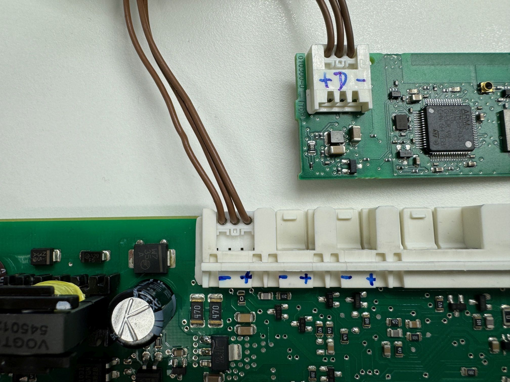
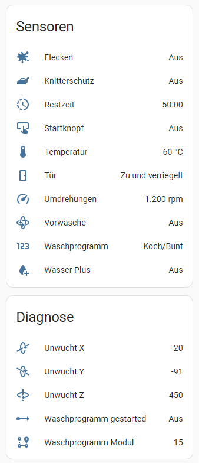

# B/S/H/ Home Appliances

## Preamble
[B/S/H/](https://www.bsh-group.com/) is one of the world's largest manufacturers of home appliances (according to [this source](https://www.faz.net/aktuell/technik-motor/technik/bsh-geschirrspueler-so-schnell-produziert-das-werk-in-dillingen-19341085.html), 10,000 dishwashers are produced _every day_ at their factory in [Dillingen](https://wiki.bsh-group.com/de/wiki/Die_Fabrik_und_das_Technologiezentrum_Dillingen/en) alone). Some of their well-known brands are Bosch, Siemens, Gaggenau, Neff, Constructa and Balay.
They have a [well-maintained wiki](https://wiki.bsh-group.com/de/wiki/Hauptseite/en) where you can find all kinds of information about the company's history and the factories.

Despite this popularity, little is publicly known about the inner workings of the appliances.
This project shows some of the things that have been discovered through reverse engineering.
This project is in no way affilliated with B/S/H/.
No intelectual property of B/S/H/ was used at any time.

Please do me a favor: :thumbsup: If you use any information or code you find here, please link back to this page.
:star: Also, please consider to star this project. I really like to keep track of who is using this to do creative things, especially if you are from other parts of the world.
:smiley: You are welcome to open an issue to report on your personal success project and share it with others.

## Warning

Household appliances work with high voltages and currents. They generate heat and steam, they shake, vibrate and have rotating parts.
You should have a good knowledge of electrics and take appropriate safety measures before opening or modifying such an appliance. Parts can get wet or hot, move or fall off.

:warning: Warning: Even if parts of the appliances operate at low voltages, depending on your specific model they may or may not be isolated from earth. This is a good chance of death or serious injury.
It is also not recommended to lead cables out of the appliance. So if you're dreaming of connecting your Raspberry Pi to the control electronics, it's probably not a good idea.

:warning: Warning: I'm not responsible if you kill your cat, your wife or yourself, whichever of these is the worst for you. You have been warned.

## Hardware

Even if the marketing materials suggest otherwise, the technology of household appliances is relatively straightforward.
A number of motors, heaters, valves and sensors are connected to a control unit and made available to the user via the fanciest possible user interface.
It also seems to be the case that a manufacturer's devices, regardless of their external appearance and brand logo, differ only marginally on the inside.

:raised_hand: The following findings are probably only applicable to a certain generation of B/S/H/ home appliances, namely those with "EP" circuit boards.
The washing machine boards are labeled "EPW", which probably stands for "Elektronik Platine Waschmaschine" (electronic circuit board washing machine).
The dryer boards are labeled "EPT", with "T" for "Trockner" (dryer) and the dishwasher boards are using "EPG", with "G" for "Geschirrspüler".
However, there is currently no known way of deducing the board version used internally from the external appearance or the model name.
You have to open the machine and look inside.

### Washing machine Siemens WM14S750

The washing machine WM14S750 was sold from around 2010, when it was the test winner of the german magazine Stiftung Warentest.
It was likely produced at the [Nauen factory](https://wiki.bsh-group.com/de/wiki/Die_Fabrik_Nauen/en).

#### Control board EPW66018

The control board ([PCB front](bsh-EPW66018-pcb-front.jpg), [PCB back](bsh-EPW66018-pcb-back.jpg)) is based on an Freescale (now NXP) Semiconductor `MC9S12Q128C-PBE16` MCU.
It also supplies power to all connected electronics.
The sticker suggests it was produced by [melecs](https://www.melecs.com/en).

It has 11 [RAST connectors](https://de.wikipedia.org/wiki/RAST-Steckverbinder) for I/O (numbering according to [PCB front](bsh-EPW66018-pcb-front.jpg)):
```
01 ?
02 Switch (not front door?)
03 ?
04 ?
05 ?
06 ?
07 ?
08 Pressure sensor and likely D-Bus on one half of the connector, not tested
09 D-Bus
10 D-Bus
11 D-Bus
```

#### User control panel EPW66027

The control panel ([Front view](bsh-EPW66027-front.jpg), [back view](bsh-EPW66027-back.jpg)) lets the user select 15 different washing programs, 8 temperatures, 7 spin speeds and and other options.
The (mechanical) rotary switch is not only used to select the program, but also to switch the mains power on and off.
The control panel is connected to the control board via D-Bus.

#### Unbalance sensor SEUFFER 9000444823

This sensors detects unbalanced loads ([PCB front](bsh-9000444823-pcb-front.jpg), [PCB back](bsh-9000444823-pcb-back.jpg), [Enclosure](bsh-9000444823-enclosure.jpg)).
It uses an [PIC18F24J10](https://www.microchip.com/en-us/product/pic18f24j10) MCU (28 pin QFN package)
and an `A007MPL DREMAS` IC, which [according to the manufacturer](https://www.ast-international.com/en.products.position-force-sensors.html#product-11) is a specialized 3D hall sensor
(the [corresponding magnet](https://www.siemens-home.bsh-group.com/uk/shop-productlist/00615666) is attached to the washing drum).
The device is connected to the control board via D-Bus.

There are 5 contact points on the back of the board that form a contact for [in-circuit serial programming (ICSP)](https://en.wikipedia.org/wiki/In-system_programming#Microchip_ICSP) (top to bottom):
`(+ sign), VDD, PGC, PGD, MCLR, VSS/GND`. The chip can be interfaced with a [PICkit](https://www.microchip.com/en-us/development-tool/pg164130) programmer
and the [MPLAB IPE](https://www.microchip.com/en-us/tools-resources/production/mplab-integrated-programming-environment).
The code can not easily be downloaded because the device has the Code Protection Bit set.

### Internet connection module BSH 8001056350 COM1/COMGEN1

The module is used to connect home appliances to the [Home Connect](https://www.home-connect.com/global) cloud (it was bought separately, according to the B/S/H/ website, it is not compatible with the washing machine WM14S750).
The model `COM1 3/21` with FCC ID `2AHES-COMGEN1` uses an ST [STM32F415](https://www.st.com/en/microcontrollers-microprocessors/stm32f415rg.html) MCU.

There is a 30-pin connector on the board (looks like a Hirose DF12 board-to-board/BTB), which is used to connect to the antenna PCB.
The antenna PCB seems to have an [6-pin connector](https://fccid.io/2AHES-COMGEN1/External-Photos/External-photos-2952945) presumably used for programming or debugging the MCU.
Unfortunately the antenna PCB is missing on my side.

### D-Bus

According to the [B/S/H/ patent documents](#misc), [this](https://www.mikrocontroller.net/topic/395115#4543950) and [this](https://forums.ni.com/t5/Instrument-Control-GPIB-Serial/Has-anybody-used-D-Bus-to-communicate-with-and-or-control/m-p/4284296#M84901) forum post, the electronics inside the device are interconnected via a proprietary serial bus called D-Bus or D-Bus-2.
Since there are no public technical specifications, it is unclear what the possible difference between version 1 and 2 might be.

The bus found on the "EP" circuit boards consists of three wires: GND, VCC and DATA. VCC is 9V and DATA is TTL (5V).
Connections are established using 3 pin 2.5 pitch [RAST connectors](https://de.wikipedia.org/wiki/RAST-Steckverbinder).
The connectors have coding lugs to ensure that they cannot be plugged into the wrong socket: The plugs with the two coding lugs in the middle are D-Bus plugs.
They are commercially available from [Lumberg](https://www.lumberg.com/en/products/product/3521), [Stocko](https://www.stocko-contact.com/downloads/STOCKO_Connector%20systems_pitch%202.5_ECO-TRONIC_de_en.pdf) and probably many more suppliers.
B/S/H/ sells somewhat pricy pre-assembled cables as well, e.g. the [spare part 00631780](https://www.siemens-home.bsh-group.com/de/produktliste/00631780).

:warning: Watch out: The assignment of the connector depends on the end point: on the control board the connector is configured as GND-DATA-VCC and then the cable is crossed and on the other side (e.g. for sensors) the wiring is VCC-DATA-GND:



## Protocol

### D-Bus

Data is transferred on the D-Bus in a `8N2` configuration (2 stop bits). However, for reading the bus the more common `8N1` configuration will work as well.
The washing machine uses 9600 baud transfer rate.
The `COM1` internet connection module cyclically tries out transfer rates from 9600 up to 38400 baud during startup, so newer devices probably use one of the higer rates.

The D-Bus is a (1-wire, the DATA wire) bus and not a straight serial cable (2-wire, RX and TX).
All participants are reading (and possibly writing) the bus simultaneously.
It is not yet clear whether the control panel acts as a master for the coordination or whether it is a [multi-master bus](https://en.wikipedia.org/wiki/Multi-master_bus)
(where something simliar to [CMSA/CR](https://de.wikipedia.org/wiki/Carrier_Sense_Multiple_Access/Collision_Resolution) or [CSMA/CD](https://en.wikipedia.org/wiki/Carrier-sense_multiple_access_with_collision_detection) is used).

This is by no means a complete description of the D-Bus protocol, but rather a layman's approach.
If you look at the comparable specification for the [CAN bus](https://en.wikipedia.org/wiki/CAN_bus) or [LIN bus](https://en.wikipedia.org/wiki/Local_Interconnect_Network),
you will see that there may be many more bits and tricks.

#### Data frames

Data on the bus is transmitted in frames.
These frames consist of a length byte, a control byte, some data bytes and a two-byte (CRC16-XMODEM, thanks [reveng](https://reveng.sourceforge.io/)) checksum. For example, the frame `03 14 10 06 78 29 de` can be decoded as follows:

```
03 14 10 06 78 29 de
LL TC DD DD DD RR RR

LL = length, 3 data bytes follow, total frame length is 7 = 1+1+3+2
TC = target id and control byte
DD = variable data with length LL
RR = checksum (CRC16-XMODEM)
```

The target id ("T" of TC-byte) designates the (unique) logical receiver of the frame and not necessarily a piece of hardware.
The control nibble ("C" of TC-byte) somehow classifies different types of frames.

Some further considerations suggest that the first and second data byte have a special meaning:

```
03 14 10 06 78 29 de
LL TC D1 D2 DD RR RR
```

All frames with identical TC-D1-D2 bytes have the same length. Therefore D1-D2 might
designate an address, register or subcmd, which then also determines the length and
format of the following bytes.

#### Acknowledgement byte

After sending a data frame, the sender leaves a gap of at least one byte
(with 9600 baud data rate and 8N2 coding an idle time of 1.145 ms = 11 x 104.167 µs)
before before possibly sending the next data frame.
The receiver responsible for processing the data frame inserts an acknowledgement byte precisely into this gap.
The sender can read this byte and knows that the data frame has been delivered successfully.

The lower bits of the acknowledgement byte are always set to 0xA (can it be that it is "A" for "Acknowledgement", really?)
and the upper bits correspond to those of the receiving target: `ACK = 0x0A | (TC & 0xF0)`.

#### Boot log

A typical boot sequence just for the control board and control panel starts like this:

```
        LL   TC D1 D2   DD DD DD DD   RR RR            ACK
0.412s  04 | 0f.e7-00 | 01 02       | a5 ec (crc=ok) | 0a (ack=ok)
0.412s  03 | 0f.e0-00 | 00          | 9a 0d (crc=ok) | 0a (ack=ok)
0.412s  04 | 1f.e8-00 | 01 02       | 75 58 (crc=ok) | 1a (ack=ok)
0.412s  04 | 1f.e0-01 | 01 02       | c7 ab (crc=ok) | 1a (ack=ok)
0.581s  04 | 0f.e7-00 | 02 02       | f0 bf (crc=ok) | 0a (ack=ok)
0.581s  04 | 1f.e8-00 | 02 02       | 20 0b (crc=ok) | 1a (ack=ok)
0.617s  02 | 0f.ef-ff |             | df 25 (crc=ok) | 0a (ack=ok)
0.617s  03 | 13.15-00 | 00          | c6 3a (crc=ok) | 1a (ack=ok)
0.768s  04 | 0f.e7-00 | 32 03       | e5 0b (crc=ok) | 0a (ack=ok)
0.849s  04 | 26.17-01 | 25 25       | 33 fe (crc=ok) | 2a (ack=ok)
0.849s  03 | 22.13-01 | 0a          | bc bc (crc=ok) | 2a (ack=ok)
0.849s  12 | 12.13-00 | 04 00 01 01 00 00 00 00 01 04 00 00 01 00 01 5a | e8 05 (crc=ok) | 1a (ack=ok)
1.028s  05 | 14.10-05 | 00 ff 01    | ce 43 (crc=ok) | 1a (ack=ok)
1.028s  03 | 14.10-04 | 04          | f0 a7 (crc=ok) | 1a (ack=ok)
1.028s  03 | 14.10-06 | 89          | d6 e0 (crc=ok) | 1a (ack=ok)
1.062s  03 | 14.10-08 | 00          | f5 4e (crc=ok) | 1a (ack=ok)
1.062s  05 | 14.10-07 | 40 00 01    | 3d 79 (crc=ok) | 1a (ack=ok)
1.100s  04 | 14.10-09 | 00 00       | 0e cb (crc=ok) | 1a (ack=ok)
1.634s  04 | 0f.e7-00 | 32 03       | e5 0b (crc=ok) | 0a (ack=ok)
1.832s  04 | 0f.e7-00 | 32 03       | e5 0b (crc=ok) | 0a (ack=ok)
1.912s  06 | 26.12-00 | 02 02 00 00 | 5d d4 (crc=ok) | 2a (ack=ok)
```

#### Interpreting frame data (WM14S750)

A closer look at the frame data for the washing machine reveals the following meaning:

```
Washing machine WM14S750

TC D1 D2 D3 D4 D5
14.10-04 xx          Temperature: xx = 0=>20°, 1=>30°, 2=>40°, 3=>50°, 4=>60°, 5=>70°, 6=>80°, 7=>90° 
14.10-05 xx ff yy    Washing program: yy_dec = 1 .. 15 (xx = ?)
14.10-06 xx          Spinning speed, multiply xx by 10 to get rpm: xx_dec = 0, 40, 60, 80, 100, 120, 137
14.10-07 xx yy zz    xx = FEATUREBITS1, yy = FEATUREBITS2, zz = 0 .. 2 VarioPerfect program number
14.10-08 00          ?
14.10-09 00 00       ?
15.11-00 01          Start button pressed on user control panel
26.10-20 xx          Wash program module xx
26.11-01 xx yy       Wash programm status: xx = 0=>Stopped, 1=>Running/end 2=>Running
26.12-00 xx yy zz    Front door status: xx = 0=>Closed+Unlocked, 1=>Closed+Locked, 2=>Open
26.17-01 00 ff       Wash program started by the washing control unit
2a.16-00 xx          Remaining time xx in minutes
47.40-02 xx yy zz    Request the unbalance sensor to send data for zz seconds (xx = node to which the response is to be sent, usually xx=17)
17.40-10 00 xh xl yh yl zh zl    Response of the 3D unbalance sensor: x/y/z readings (3x signed int16)

FEATUREBITS1 = Logical OR of
0x02 = Water Plus / Wasser Plus
0x20 = Stains / Flecken
0x40 = ?
0x80 = Prewash / Vorwäsche

FEATUREBITS2 = Logical OR of
0x80 = Anti-crease protection / Knitterschutz

TARGET ("T" of TC-byte)
0x0 Network management / Broadcast
0x1 Washing control unit
0x2 User control panel
0x4 Unbalance sensor

CONTROL ("C" of TC-byte)
0x2 ?
0x3 ?
0x4 set ?
0x6 ?
0x7 ?
0xa info ?
0xf system cmd ?
```

Pure guesswork:

```
TC D1 D2
_f.e7-00  Ping / Identify request ?
_f.e8-00  Ping / Identify response ?
_f.e0-00  Read / Something request ?
_f.e0-01  Read / Something response ?
_2.13-01  Read / Something request ?
_2.13-00  Read / Something response ?
```

## Software

With just an [ESP8266, a piggyback 9V-to-5V-DC-DC converter and a few cables](bsh-dbus-esp8266-logger.jpg) one easily can interface the D-Bus
(lab setup only, not recommended to be installed in a real home appliance, see notes below).

:warning: Warning: Please double check that you have read and followed the [safety notes](#warning) before connecting anything to a live device.
I repeat: It is not guaranteed that the D-Bus is isolated from earth.

:question: The [ESP8266 GPIOs are 5V-tolerant](https://twitter.com/ba0sh1/status/759239169071837184),
but unsure whether this is the best way to connect to the D-Bus or whether pull-up resistors or similar are missing.
Please help if you have expertise in this area.

:question: Additionally, the ESP8266 is drawing too much power from the 9V VCC pin.
During the WiFi connection phase, [current spikes of up to 430mA](https://www.ondrovo.com/a/20170207-esp-consumption/) occur, which seems to exceed the maximum available current of the machine's power supply.
Adding a 470uF capacitor between the GND and VCC pin of the D1 and limiting the WiFi output power (`output_power: 10.5dB`) seems to be a dirty workaround, though not a reliable solution everyone should use.
Please help if you have expertise in this area.

### Arduino

[bsh-dbus-logger.ino](bsh-dbus-logger.ino) aims to fully interpret bus traffic including acknowledgements. It's work in progress, though.

### Home Assistant / ESPHome

[bsh-dbus-wm14s750.yaml](bsh-dbus-wm14s750.yaml) is a ESPHome config file to integrate the washing machine in Home Assistant:



This is more or less a proof-of-concept which uses the debug functionality of the UART interface,
so not yet a real integration via an [external component](https://esphome.io/components/external_components.html).
But it works well :)

## Misc

- B/S/H/ has received several patents that mention the D-Bus:
  - [DE102009046706A1](https://worldwide.espacenet.com/patent/search/family/043510107/publication/DE102009046706A1?q=pn%3DDE102009046706A1)
    describes a USB to CAN or D-Bus gateway.
  - [DE102009026752A1](https://worldwide.espacenet.com/patent/search/family/042480518/publication/DE102009026752A1?q=pn%3DDE102009026752A1)
    describes a way to interact with the home appliance for remote customer service.
  - [DE102013205754A1](https://worldwide.espacenet.com/patent/search/family/050343707/publication/DE102013205754A1?q=pn%3DDE102013205754A1)
    describes how to add a cryptography layer to the D-Bus (a kind of DRM to protect e.g. cooking recipes).

- The eBUS (“energy bus” used by numerous heating systems) has similarities to the D-Bus. The [eBUSd project](https://ebusd.eu/) is very
  mature, they even have designed a clever [hardware adapter](https://adapter.ebusd.eu/index.en.html).
  The [specification](https://adapter.ebusd.eu/Spec_Prot_12_V1_3_1.pdf) is well worth reading and helps a lot to understand the D-Bus,
  although the protocol differs in some aspects.

- I don't own a WM14S750 washing machine, but only, let's call it, a [lab setup](bsh-wm-lab-setup.png).

- If you think this is all weird stuff, you haven't seen the [Zabex washing machine project](https://www.zabex.de/site/waschmaschine.html).
