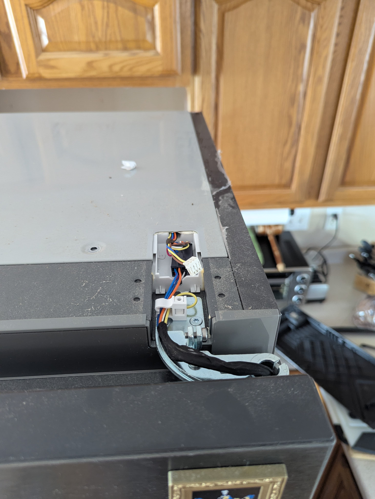
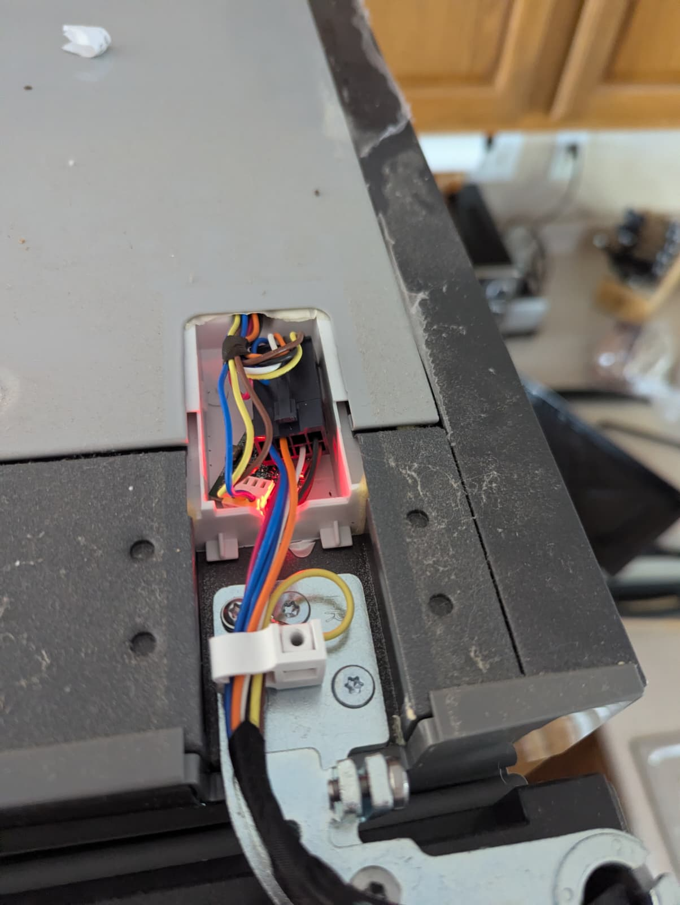

# B/S/H/ Home Appliances - Refrigerators

:warning: Warning: Please double check that you have read and followed the [safety notes](README.md#warning)

## Hardware

The B36CT80SNB/09 is really unfairly easy to connect.  It has a 'diagnostic' port hidden in the upper hinge
which is an RST connector.  All you need is a tox screwdriver to remove the cover and one of the smaller boards
that can fit under the cover (the [BSH Board](https://github.com/Bouni/BSH-Board/] works great)

There is a ton of data on the bus that is not yet decoded and sometimes packets that aren't decodable.

[Example Config](contrib/bsh-dbus-b36ct80snb.yaml)
