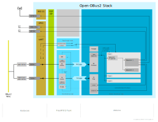
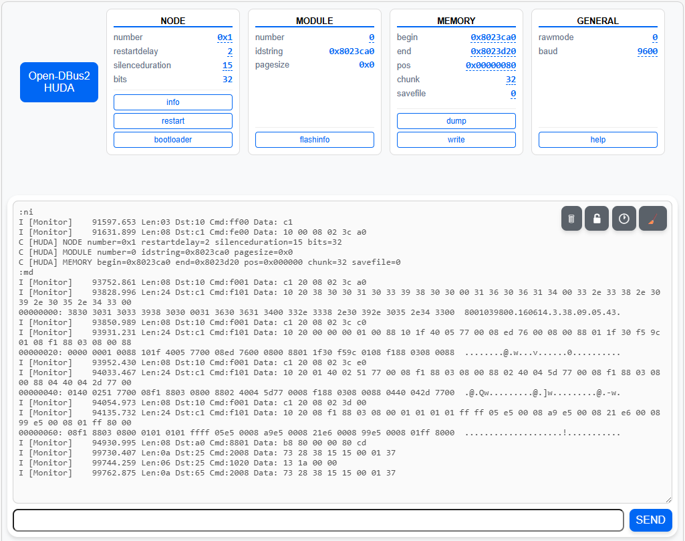

# Open-DBus2

This provides the infrastructure to implement one or more nodes for
bidirectional frame communication on the B/S/H/ DBus2.

To put it more vividly: This stack is intended to eventually facilitate
the development of custom components for B/S/H household appliances.
It is entirely conceivable to e.g. remove the original user interface panel
from a machine and replace it with a custom-made interface powered by
this software. While implementing a full replacement would be a significant
undertaking, some of the initial groundwork is here.

This is an independent, open-source project and is not affiliated with,
endorsed by, or sponsored by B/S/H/ or its affiliates. All product names
and trademarks are the property of their respective owners. References
to B/S/H/ appliances are for descriptive purposes only and do not imply
any association with B/S/H/.

## Status

This code is a direct artifact of reverse engineering. Hopefully much of
the DBus2 protocol is correctly implemented, but this can not be guaranteed.

## Overview

The stack is organized in three layers: the hardware/UART interface, a dedicated
FreeRTOS task for time-critical bus processing, and the Arduino loop for frame
dispatch and application logic. The FreeRTOS task handles byte-by-byte UART
parsing, CRC validation, ACK/NACK generation, and the RX/TX queues.
Application logic is structured around nodes, each with one or more subsystems.
Nodes register with the central bus manager and receive frames matched by node ID
and subsystem ID.



#### The bus task

The FreeRTOS bus task processes UART bytes through a state machine, validates
frames with CRC, and manages RX and TX queues. On the receive side, validated
frames are enqueued for dispatch. On the transmit side, frames are sent with
configurable retries and timeouts. ACK/NACK handling follows the protocol:
unicast frames are acknowledged by the receiver; broadcast frames are
self-acknowledged by the sender.

#### Frame dispatch

The Arduino `loop()` calls `process()`, which dequeues received frames and
dispatches them to registered nodes by node ID. Within each node, frames are
further routed by subsystem ID to the registered command handler.

#### Promiscuous mode

Any node can opt into promiscuous mode to receive all frames on the bus,
regardless of destination. Observer nodes — with IDs above `0xF` and therefore
not addressable on the wire — use this to monitor all bus traffic. Observer
nodes cannot send frames.

#### Special modes

The bus manager supports passthrough modes for direct bus interaction without
framing, including raw mode and bootloader mode. These modes are controllable
at runtime.

## Building

This project uses [PlatformIO](https://platformio.org/) with the Arduino
framework. All build configuration lives in `platformio.ini`.

```bash
# Build for all environments
pio run

# Build for a specific board
pio run -e kiu-bashi-c3     # kiu BaSHi board (ESP32-C3)
pio run -e bouni-board       # Bouni board (ESP32-C6)

# Upload firmware
pio run -e kiu-bashi-c3 --target upload

# Serial monitor
pio device monitor -b 115200
```

### Supported Boards

| Environment    | Board | MCU      | Link |
| :---           | :---  | :---     | :--- |
| kiu-bashi-c3   | kiu BaSHi | ESP32-C3 | [github.com/kiu/BaSHi](https://github.com/kiu/BaSHi) |
| bouni-board    | Bouni Board | ESP32-C6 | [github.com/Bouni/BSH-Board](https://github.com/Bouni/BSH-Board) |

It's very easy to add your own board definition in `platformio.ini`.

### WiFi / WebSerial

If `WIFI_SSID` and `WIFI_PASS` are defined in `platformio.ini` build_flags,
the module connects to your WiFi network. A
[WebSerial](https://github.com/mathieucarbou/MycilaWebSerial) console becomes
available, mirroring all serial output bidirectionally. This is particularly
useful for maintaining galvanic isolation from the household appliance during
testing.

OTA firmware updates are available when `OTA_PASS` is also defined. Send a
POST request to `http://<ip>/ota` with Basic Auth (user: `ota`, password as
defined) and the firmware binary as a `firmware` form field:

```bash
curl -u ota:<password> -X POST http://<ip>/ota -F "firmware=@firmware.bin"
```

### Project Structure

```
platformio.ini          # Build config, board definitions, pin mappings
include/                # Header files
  DBus2Frame.h          # Frame struct (standalone, no Arduino dependency)
  DBus2Subsystem.h      # Subsystem base class: lifecycle, command dispatch
  DBus2Node.h           # Node base class
  DBus2Manager.h        # Bus manager: UART, state machine, TX/RX queues
  DBus2Log.h            # Compile-time logging macros
  FlexConsole.h         # Serial/WebSerial bridge
  nodes/                # Application node headers
src/                    # Implementation files
  main.cpp              # Entry point: setup(), loop()
  DBus2Manager.cpp      # Bus manager implementation (FreeRTOS task)
  FlexConsole.cpp       # Serial/WebSerial bridge implementation
  nodes/                # Application node implementations
```

Nodes are enabled by instantiating them in `main.cpp` and registering them
with `dbus.registerNode()`.

## Nodes

### PingDemo.cpp

Sends periodic pings to `PongDemo` for bus connectivity testing. Sending can be
toggled at runtime via command `0x7777` (payload byte 0: `0x01` = enable,
`0x00` = disable). Node ID `0x7`.

### PongDemo.cpp

Responds to pings from `PingDemo`. Node ID `0x8`.

### Monitor.cpp

Promiscuous observer that logs all bus traffic to the console. Not addressable
on the bus (observer node ID `0xD0`).

### LedStatus.cpp

Promiscuous observer that blinks a heartbeat LED and flashes an activity LED
on bus traffic. Uses compile-time optional pins `DBUS_PIN_LED_HEARTBEAT` and
`DBUS_PIN_LED_ACTIVITY`. Observer node ID `0xD1`.

### UnbalanceDemo.cpp

Periodically requests 3D unbalance sensor readings from Node `0x4` every 15
seconds (5-second measurement window) and logs the X/Y/Z response as signed
int16 values. Sending can be toggled at runtime via command `0x7777`. Node ID `0x5`.

### Dishwasher39C3.cpp

Emulates the dishwasher power module EPG60110 at DBus2 address `0x1`. It sends
frames to the user interface panel BSH9000329063 to display custom strings and UI
elements. This was used during the
[39C3 talk](https://media.ccc.de/v/39c3-hacking-washing-machines) to
demonstrate external control over the appliance display. Node ID `0x1`.

### DishwasherUIPSimple.cpp

Emulates a dishwasher UI panel at DBus2 address `0x2`. It only responds to
presence checks on Subsystem 2 and does nothing else. Node ID `0x2`.

### DishwasherCtrlA.cpp (not released yet)

Emulates endpoint `0xA` of a SN658X06TE dishwasher power module, performing
the handshake with a COM1 WiFi module until it is fully initialized. Handles
the full registry-based communication protocol including basic info exchange,
runtime info, export values and export structure. This was also featured in the
39C3 demonstration. Node ID `0xA`.

### MqttGateway.cpp

Bridges DBus2 frames bidirectionally to an MQTT broker. All bus traffic is
published as JSON; incoming MQTT messages are parsed and sent as frames on the
bus. Requires WiFi and a reachable MQTT broker. Node ID `0x9`.

This node is conditionally compiled — it is only included when both `WIFI_SSID`
and `MQTT_BROKER` are defined in `platformio.ini` build_flags.

#### Configuration

Add to `build_flags` in your board's `platformio.ini` environment:

```ini
-D MQTT_BROKER=\"192.168.1.100\"
-D MQTT_PORT=1883              ; optional, default 1883
-D MQTT_USER=\"user\"          ; optional
-D MQTT_PASS=\"pass\"          ; optional
```

#### MQTT Topics

```
dbus2/<mac>/rx/<dest>/<cmd>    — Received command frame (published)
dbus2/<mac>/rx/<dest>          — Received non-command frame (published)
dbus2/<mac>/tx                 — Send a frame (subscribe)
```

- `<mac>`: WiFi MAC address, lowercase hex, no separators (`aabbccddeeff`)
- `<dest>`: Full dest byte, 2 hex chars lowercase (`1a`, `00`)
- `<cmd>`: Command ID, 4 hex chars lowercase, no `0x` prefix (`1234`)

#### JSON Format

**RX command frame** (data >= 2 bytes):
```json
{"dest":"1a","cmd":"1234","payload":"aabb"}
```

**RX non-command frame** (data < 2 bytes):
```json
{"dest":"1a","data":"ff"}
```

**TX** — publish to the `tx` topic in the same format. If `cmd` is present,
the frame is sent via `sendCmd()`. If `data` is present, it is sent as a raw
frame via `send()`.

### Huda.cpp

A diagnostic toolbox node at `0xC` for interacting with participants on the DBus2.



When connected via WebSerial, a dashboard is automatically initialized on
connect. It shows all available variables grouped by section and provides
action buttons. Type `:?` to re-initialize the dashboard, and `:` to refresh
all current values.

Terminal input is interpreted as hex frame data — length and CRC are added
automatically before sending. If a terminal entry begins with a colon (`:`),
it is treated as a control command. Variables are set by typing `:<cmd><value>`,
actions are triggered by typing `:<cmd>`.

In raw mode (`:rm1`), hex input is sent as-is to the bus without length or CRC.
All colon commands are blocked in raw mode except `:rm0` to exit.

Example output for the Unbalance sensor (node `0x4`) with a request to send readings for 5 seconds:

```
47.40-02 c7 80 05

05 | 47.40-02 | C78005 | CFAC
09 | C7.40-10 | 00FADF01E501A4 | 2CF1
09 | C7.40-10 | 00F8FF00CA02AF | 977E
09 | C7.40-10 | 00F802FB6A032C | 2746
09 | C7.40-10 | 00FC5B02520180 | 8E93
```

The following commands are available:

| Section | Command | Description |
| :--- | :--- | :--- |
| _NODE_ | | |
| | `:nn<hex>` | Set node number (e.g. `:nn6`) |
| | `:nd<dec>` | Set restart delay (units of 10 ms) |
| | `:ns<dec>` | Set silence duration (2–63, units of 2s) |
| | `:ni` | Request node info — sets MCU bit size and locates the id string in memory |
| | `:nr` | Restart the node |
| | `:nb` | Enter bootloader mode |
| _MODULE_ | | |
| | `:mn<dec>` | Set module number |
| | `:mf` | Request flash page size |
| _MEMORY_ | | |
| | `:mb<hexaddr>` | Set memory begin address |
| | `:me<hexaddr>` | Set memory end address |
| | `:mp<hexaddr>` | Set memory position |
| | `:mc<dec>` | Set chunk size (reduce for older/slower modules) |
| | `:ms<0\|1>` | Save dump as binary file in browser |
| | `:md` | Dump memory at current position; output can be converted to binary with `xxd -r -c256` (prefer `:ms1` for convenience) |
| | `:mw<hexstring>` | Write hex data to memory at current position |
| _GENERAL_ | | |
| | `:rm<0\|1>` | Toggle raw mode |
| | `:bb<baud>` | Set bus baud rate (`9600`, `19200`, `38400`) |
| | `:?` | Initialize dashboard / print HELP |
| | `:` | Refresh all current values |

Example session for a Timelight module (node `0x6`):

```
:nn6
| NODE number=0x6 module=0 bits=0 | MEMORY begin=0x8000000 end=0x8000100 pos=0x000000 chunk=16 |
:ni
| NODE number=0x6 module=0 bits=0 | MEMORY begin=0x8000000 end=0x8000100 pos=0x000000 chunk=16 |
03 | 60.FF-00 | C0 | A12F
08 | C0.FE-00 | 60000001FFA8 | 2689, handled by: Identify response, Node 0x6, Module 0, info string at 0x0001ffa8 (32-bit node)
:md
| NODE number=0x6 module=0 bits=32 | MEMORY begin=0x01ffa8 end=0x020028 pos=0x000000 chunk=32 |
00000000: 4330 322d 3030 3600 3830 3031 315f 3031 3535 3400 3138 3031 3138 3133 3231 6400  C02-006.80011_01554.1801181321d.
00000020: 3930 3031 3336 3638 3437 0000 0056 574b 4936 4453 0535 33ff 3930 3031 3336 3638  9001366847...VWKI6DS.53.90013668
00000040: 3437 ffff 0307 ffff 1907 1515 aaff ffff 60ca ffff 0101 ffff ffff ffff ffff ffff  47..............`...............
```

